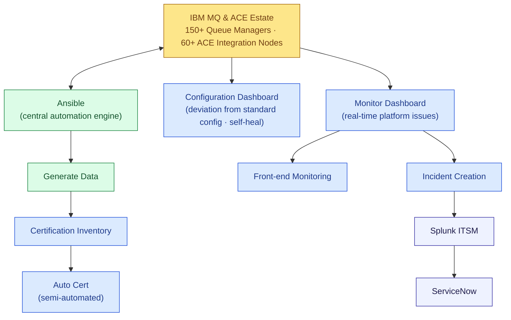

# Slide 03 — From Zero to Thirteen: Our Automation Journey

**Sub-headline:** *We didn't wait. Two years of in-house automation has already pulled the most painful work off the team's plate.*

> Voice of the slide: **us — the MQ/ACE Platform Support team.** A maturity story, told in numbers and a picture.

---

## The arc, in three numbers

| **Pre-2024** | **2024** | **2025** |
|:---:|:---:|:---:|
| **0** automations | **9** automations | **13** automations |
| Pure manual operations | First wave delivered | Full coverage of the 5 tracks below |

---

## The automation landscape — today

---

## What the 13 automations cover

- **Configuration Dashboard** — surfaces any **deviation of the platform from its standard configuration**, with self-heal that auto-remediates drift back to the baseline.
- **Monitor Dashboard** — shows **real-time platform issues** across the estate at a glance, replacing per-system checks. Splits into two outputs:
  - **Front-end Monitoring** — the live operator view.
  - **Incident Creation** — issues flow automatically into **Splunk ITSM → ServiceNow**; no one opens a ticket by hand.
- **Certification Inventory** — generated data feeds a central register of every certificate, owner, and expiry across the estate.
- **Auto Cert (semi-automated)** — certificate renewal and rotation, driven from the inventory.

---

## What this changed for the team

- **Fewer routine pings.** The most repetitive manual work now runs itself — admins are interrupted less for state checks.
- **No more "open a ticket by hand."** Detected incidents land in Splunk ITSM and ServiceNow automatically, with the right context attached.
- **Certificate expiries stopped being a fire drill.** Inventory + semi-automated renewal turned a perennial outage risk into a tracked, scheduled activity.
- **A live monitoring picture replaced manual round-trips** to dozens of consoles for the highest-volume diagnostic questions.

---

**Speaker note:** Thirteen automations is real progress — but it isn't the finish line. Each automation still answers a *predefined* question; anything outside the script still escalates to a human. The next step is closing that gap.
