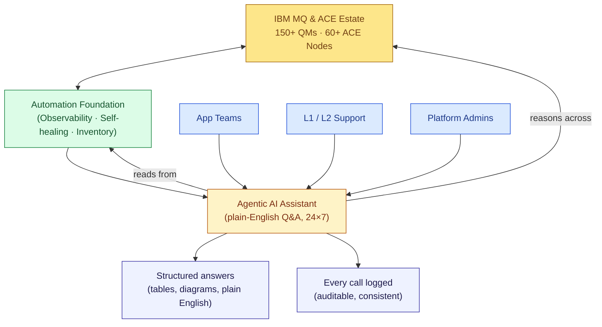

# Slide 04 — The Next Layer: Agentic AI for Self-Service

**Sub-headline:** *Observability and self-healing answer the questions we knew to script. Agentic AI answers the ones we didn't.*

> Voice of the slide: **us — the MQ/ACE Platform Support team.** Building on the foundation slide 03 laid out; opening the door to anyone who needs an answer.

---

## The maturity stack — where we are, where we're going

| Layer | Capability | Who is served | Status |
|---|---|---|---|
| **1. The Estate** | 150+ Queue Managers · 60+ ACE Integration Nodes | The business | Always-on |
| **2. Observability** | Monitor Dashboard, real-time issue surfacing, auto-incident creation → Splunk ITSM → ServiceNow | Ops + L1/L2 | ✅ Delivered (2024–25) |
| **3. Self-healing** | Configuration Dashboard (drift detection + auto-remediation), Certification Inventory + Auto Cert | Ops | ✅ Delivered (2024–25) |
| **4. Agentic AI self-service** | Plain-English Q&A across the entire estate — anyone, any question, any time | **App teams, L1, L2, admins** | 🚀 **This step** |

Each layer **builds on the one below.** The agentic AI layer reuses the same Ansible-generated data, the same monitoring feeds, and the same inventory — it doesn't replace them.

---

## The gap our automations can't close

- **Scripted automations answer questions we already knew to ask.** They run when the schedule fires or when a threshold trips. They don't answer *"why is this specific message stuck right now?"*.
- **Free-form questions still come to us.** *"What's the depth of queue X?"*, *"Is flow Y deployed on node N?"*, *"Which integration node hosts this app?"* — every one of these still escalates to the same small SME group.
- **App teams, L1, and L2 are still gated by us.** They can read a dashboard, but they can't *ask* the platform a question.

This is the gap agentic AI closes.

---

## The foundation → the next step

---

## What the Agentic AI brings — in plain language

- **Picks the right tool by itself.** No scripts, no decision trees written by us. The AI reads the question, plans the steps, calls the right diagnostic, and assembles the answer.
- **Reasons across the whole estate in one go.** A single question can pull from MQ, ACE, inventory, and monitoring data — the user doesn't need to know where to look.
- **Plain English in. Structured answer out.** Tables, diagrams, summary paragraphs — formatted for a human, not a console.
- **Bounded by design.** Read-only by construction (no command can change anything); only approved hosts in scope; off-topic questions refused without touching any system.
- **Every interaction is logged.** Who asked, what was queried, how long it took, what was returned — auditable from day one.
- **Same answer for everyone.** No more "depends who you asked" — the AI is consistent across users and across time.
- **Always on.** 24×7, no on-call rotation, no waiting for Monday morning.

---

## What this changes

- **App teams self-serve.** They stop opening tickets for state questions and stop waiting on us for routine answers.
- **L1 / L2 close their own tickets.** The "what is the state of X?" category — which dominates the queue today — collapses.
- **Our team reclaims engineering time.** The hours we used to spend answering recurring questions go back into capacity planning, modernisation, and resilience work.
- **Onboarding accelerates.** New joiners learn the platform by *asking the AI*, not by shadowing an SME for months.

---

**Speaker note:** Slide 03 was about taking known toil off the team's plate. Slide 04 is about taking the **rest** off — the free-form, unpredictable, "I just need to know X" questions that no script can anticipate. This isn't a chatbot bolted onto a dashboard; it's an autonomous reasoner that decides which diagnostics to run, in what order, and how to present the answer — within guardrails we set. The foundation we built in 2024–25 is exactly what makes this safe and credible to roll out.
