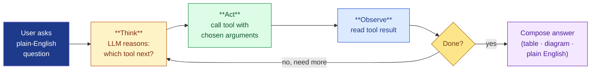

# Slide 05 — How the Agentic AI Works: End-to-End Architecture

**Sub-headline:** *One conversation. Five layers. Every step bounded, streaming, and auditable.*

> Voice of the slide: **us — the MQ/ACE Platform Support team.** The "under the hood" answer to slide 04's promise — shown as a diagram, not a wall of text.

---

## The end-to-end request flow

```mermaid
flowchart LR
  U["**User**<br/>App team · L1 · L2 · Admin"]:::user

  subgraph FE["Frontend"]
    direction TB
    C["**Web Chat UI**<br/>Streamlit · httpx<br/>streaming · session memory"]:::frontend
  end

  subgraph BE["Agentic Backend"]
    direction TB
    A["**LangGraph ReAct Agent**<br/>GPT-5.5 reasoner<br/>MemorySaver (per thread)"]:::backend
    R["**ReAct Loop**<br/>think → act → observe<br/>(LLM picks every step)"]:::loop
    A -.-> R -.-> A
  end

  subgraph MCP["MCP Server (Python)"]
    direction TB
    T["**Tool Registry**<br/>17 read-only tools<br/>(7 MQ · 6 ACE · 1 Cert · 3 Splunk)"]:::mcp
    S["**Safety Layer**<br/>hostname allow-list<br/>read-only enforcement<br/>error sanitisation"]:::safety
    T --> S
  end

  subgraph TGT["Target Systems (read-only)"]
    direction TB
    MQ["**IBM MQ REST API**<br/>dspmq · runmqsc<br/>queue depth · channel status"]:::target
    ACE["**IBM ACE Admin REST**<br/>nodes · servers<br/>applications · message flows"]:::target
    CSV["**Inventory CSVs**<br/>queue managers · ACE nodes<br/>(offline manifests)"]:::target
  end

  L["**Audit Log**<br/>(JSONL · daily-rotated)<br/>request_id · caller · tool<br/>args (redacted) · latency · outcome"]:::audit
  PBI["**Power BI**<br/>trend dashboards"]:::audit

  U  -->|plain-English question| C
  C  -->|SSE stream| A
  A  -->|MCP protocol<br/>(open standard)| T
  S  --> MQ
  S  --> ACE
  S  --> CSV
  MQ -.->|result| T
  ACE -.->|result| T
  CSV -.->|result| T
  T  -->|tool response| A
  A  -->|streaming answer<br/>(tokens · tool steps · final)| C
  C  -->|table · diagram · plain English| U

  T  -.->|every call| L
  L  -.->|ingest| PBI

  classDef user      fill:#1E3A8A,stroke:#1E3A8A,color:#FFFFFF,stroke-width:1px
  classDef frontend  fill:#DBEAFE,stroke:#1D4ED8,color:#1E3A8A
  classDef backend   fill:#FEF3C7,stroke:#B45309,color:#7C2D12
  classDef loop      fill:#FDE68A,stroke:#A16207,color:#713F12,stroke-dasharray:3 3
  classDef mcp       fill:#DCFCE7,stroke:#15803D,color:#14532D
  classDef safety    fill:#FECACA,stroke:#B91C1C,color:#7F1D1D
  classDef target    fill:#E0E7FF,stroke:#3730A3,color:#1E1B4B
  classDef audit     fill:#F3E8FF,stroke:#6B21A8,color:#4C1D95
```

---

## What each layer does — at a glance

| # | Layer | Built with | Job |
|---|---|---|---|
| **1** | **Web Chat UI** | Streamlit · httpx · python-dotenv | The only thing the user sees. Streams the agent's tokens, tool steps, tables, and diagrams in real time. Per-session memory via `thread_id`. Pure Python — no Node/React build step to operate. |
| **2** | **Agentic Backend** | FastAPI · LangGraph `create_react_agent` · GPT-5.5 · `MemorySaver` | The brain. Runs the ReAct loop — the LLM picks which tool to call, with what arguments, and when to stop. No hand-coded if/then routing. |
| **3** | **MCP Server** | Python · FastMCP · SSE endpoint | The toolbox. Exposes 17 read-only diagnostics (7 MQ + 6 ACE + 1 Certificate + 3 Splunk log search) over the **Model Context Protocol** — Anthropic's open standard (the "USB-C of AI tools"). Any MCP-compliant client can use the same server. |
| **4** | **Safety Layer** | `server/safety.py` · `server/errors.py` | Three independent enforcements: **hostname allow-list** (only approved hosts reachable), **read-only enforcement** (every MQSC modification verb blocked at the tool boundary), **error sanitisation** (no raw tracebacks or upstream bodies ever reach the user). |
| **5** | **Target Systems** | IBM MQ REST API · IBM ACE Admin REST · offline inventory CSVs | The live platform. The agent reads from these — never writes. Three sources covered: live MQ, live ACE, plus offline inventory dumps for fast lookups. |
| **+** | **Audit Log** | JSONL daily files · Power BI ingestion | Every call gets a `request_id`, caller, tool name, args (secrets auto-redacted), endpoints hit, latency, outcome. Audit-ready from day one; Power BI-readable. |

---

## The ReAct loop — the inner detail

Every user question triggers this loop **inside the agentic backend**:



- **Think → Act → Observe** repeats until the agent decides it has the full answer.
- The user **sees every step stream by** — no black box.
- A single question can chain **multiple tool calls** (e.g., "find queue → resolve alias → check depth on the right QM → compose answer") with no human in between.

---

## Why this architecture, in one line per choice

- **MCP as the wire protocol** — vendor-neutral, open, future-proof. Any compliant client (Claude Desktop, VS Code, our chat UI) plugs into the same server.
- **Hostname allow-list** — even an exploited agent cannot reach production hosts that aren't on the list. Default-deny posture.
- **Per-call audit log** — the same data feed that powers Power BI also satisfies risk and audit asks without extra instrumentation.
- **Streaming everything** — tokens, tool calls, tool results, final answer — all flow live to the UI. Sub-second time-to-first-byte; transparent reasoning.

> Read-only enforcement, secret redaction, and the full coding-standards story are covered on slide 06.

---

**Speaker note:** This is not a chatbot with an API stitched to the back. It is an autonomous reasoning agent with a bounded, audited surface area — every layer was chosen so the security, observability, and read-only guarantees are properties of the architecture itself, not policies that have to be re-enforced by every developer. The next slide opens the hood further — the engineering controls, coding standards, security shield, and governance that make this safe to roll out against production diagnostics.
