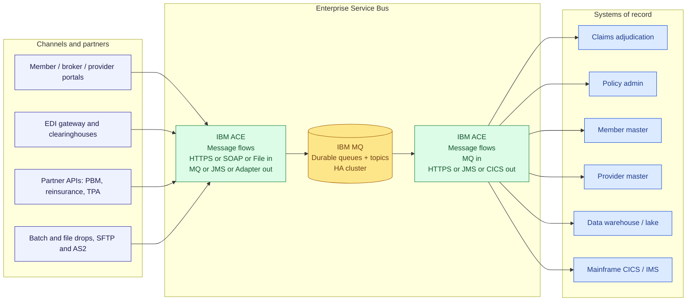
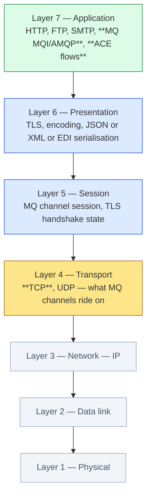
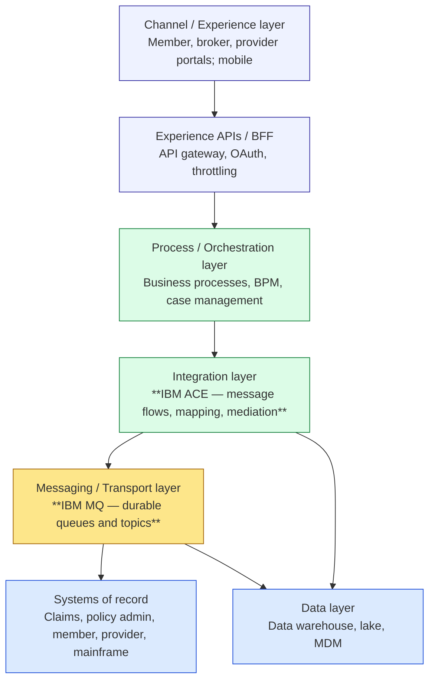

# Where IBM MQ and IBM ACE sit in the middleware stack

A short, vendor-neutral primer for engineers and operators who land on
this repo without a background in enterprise messaging or integration.
Tells you what the two products *are*, the role each plays for a typical
insurance carrier, the ESB-style topology they form together, and where
they slot into the standard layered reference models.

> The Mermaid diagrams below render natively on GitHub. For VS Code:
> `code --install-extension bierner.markdown-mermaid`.

---

## What is IBM MQ?

**IBM MQ** (originally MQSeries, 1993) is *message-oriented middleware* —
a transport that moves business messages between applications with
guaranteed, transactional, once-and-once-only delivery.

| Feature | What it gives you |
|---|---|
| Persistent queues | Survive broker restarts; nothing is lost mid-flight. |
| Asynchronous send/receive | Producer doesn't block on consumer. |
| Transactional units of work | A message is either consumed *and* its side-effects committed, or both roll back. |
| Pub/Sub topics | One-to-many distribution alongside point-to-point queues. |
| Clustering | Many queue managers behind one logical name for HA and load balancing. |
| Channels | Encrypted, authenticated TCP pipes between queue managers and clients. |
| Cross-platform | The same wire protocol on z/OS, Linux, AIX, Windows, Solaris, containers. |

In one line: **MQ guarantees the message arrives, exactly once, even if
the other side is down right now.**

## What is IBM App Connect Enterprise (ACE)?

**IBM ACE** (formerly IBM Integration Bus, formerly WebSphere Message
Broker) is an *integration runtime* — it hosts graphical pipelines
called **message flows** that consume an input on one protocol,
transform/enrich/route it, and produce output on one or more other
protocols.

| Capability | Examples |
|---|---|
| Protocol adapters | MQ, HTTP/REST, SOAP, File, FTP/SFTP, JMS, Kafka, TCP/IP, MQTT, email |
| Domain parsers | XML, JSON, CSV, fixed-length, COBOL copybook, X12 EDI, HL7, SWIFT, FIX |
| Application connectors | CICS, IMS, SAP, Salesforce, Microsoft Dynamics, Oracle, DB2, MQ, Db2 z/OS |
| Transformation | XSLT, Graphical Data Mapper, ESQL, Java, .NET, Python |
| Orchestration | Routing, aggregation, filtering, content-based dispatch, retries |
| Operational shape | A *node* hosts *integration servers*, each runs *applications/libraries* containing one or more *message flows* — see `list_ace_servers`, `list_ace_applications`, `list_ace_message_flows`. |

In one line: **ACE is the place where "JSON-over-HTTPS from a partner
portal" turns into "X12 837 claim on an MQ queue", with no app code
written.**

---

## How insurance carriers use them (real-world patterns)

Most large carriers run MQ as the durable bus and ACE as the
transformation/orchestration layer between channels and core platforms.
The usual workloads:

| Domain | What's flowing | Why MQ + ACE |
|---|---|---|
| **Claims intake** | Provider clearinghouse / EDI gateway → adjudication engine. X12 **837** in, **277CA** + **835** out. | High volume, must not lose a claim, must survive nightly batches. Mainframe-style transactional guarantees. |
| **Eligibility & benefits** | Real-time member look-ups. X12 **270** in, **271** out. | Sub-second response under spikes; ACE translates HTTPS↔X12↔CICS. |
| **Enrollment** | Broker / employer feeds. X12 **834**. | Batch + delta files; ACE handles parse, dedupe, route to policy admin. |
| **Member & provider portals** | REST/JSON from web/mobile → SOAP/MQ → mainframe systems of record. | Decouples public-facing TPS from core system release cycles. |
| **Provider data** | Credentialing, network rosters, fee schedules. | Multi-source merge in ACE; durable distribution over MQ. |
| **Pharmacy / PBM** | NCPDP claims, real-time formulary checks. | Strict latency, strict reliability — MQ-backed REST mediation. |
| **Correspondence / EOB** | Adjudication output → print/output management → member portal. | Fan-out via topics; ACE renders/transforms templates. |
| **Reinsurance & TPA feeds** | File and EDI exchanges with external partners. | Scheduled flows in ACE; secure transports (SFTP, AS2, MQ-FTE). |
| **Audit & compliance** | Every business event tee'd to a topic. | MQ pub/sub guarantees the auditor's subscriber gets a copy. |
| **Modernisation** | Legacy CICS/IMS transactions exposed as REST. | ACE handles protocol mediation; MQ provides the reliable conduit. |

The pattern is consistent: **MQ owns the transport guarantees, ACE owns
the protocol and format translations**. Carriers can swap a portal,
upgrade a claims engine, or add a new partner without touching the
others, because everything meets in the middle on a queue or a flow.

---

## The ESB view — how MQ and ACE work together

**Reading the picture left-to-right:**

1. *Channels* speak whatever protocol they speak — HTTPS/JSON, SOAP,
   X12 over AS2, files over SFTP, partner APIs.
2. The *first ACE tier* normalises them onto MQ. It parses the partner
   payload, validates, enriches with reference data, and drops a
   canonical business message on a queue.
3. *MQ* holds the message durably. The downstream system can be slow,
   restarting, or doing nightly batch — the queue absorbs the burst.
4. The *second ACE tier* dequeues, transforms to the system of record's
   expected format, and invokes it (CICS transaction, REST call,
   stored procedure, file write).
5. Replies flow back the other way through the same fabric.

Why this shape rather than point-to-point integration?

| Property | Without an ESB | With MQ + ACE |
|---|---|---|
| Coupling | N × M connections | N + M connections to the bus |
| Failure of one consumer | Lost messages or upstream blocked | Queue holds them until consumer recovers |
| Protocol change on one side | Every counterparty redeploys | Change one ACE flow |
| Auditing | Per-system, ad hoc | One subscription on a topic |
| Throughput shaping | Caller's problem | Queue depth + ACE concurrency knobs |

---

## Layer mapping — where does this actually live?

There are two layered models worth situating MQ and ACE against. They
answer different questions and they do not overlap.

### A. The OSI model — "what network layer?"

- **MQ uses TCP (L4) as its underlying transport** — `dspmqver` /
  `dspmq` and the MQ REST API in this repo all ride HTTPS-over-TCP.
- **MQ as a protocol lives at L7** — MQI, AMQP, the MQ wire format are
  application-layer protocols. MQ is not a Layer 4 transport in the
  OSI sense; it's an *application-layer messaging service that
  provides transport-like guarantees* (durability, ordering, exactly
  once).
- **ACE is firmly L7** — every node in a flow speaks an application
  protocol.

### B. The enterprise architecture "stack" — "what business layer?"

This is the diagram you'll see in carrier reference architectures and
in RFPs. It's not OSI; it's an organisational view of the IT estate.

- **MQ is the carrier's "Transport / Messaging layer"** in this view —
  the durable bus that everything else publishes to and consumes from.
- **ACE is the "Integration layer"** sitting one rung above —
  protocol mediation, format translation, content-based routing.
- The *Process / Orchestration* layer above (BPM, case management,
  workflow) calls into ACE flows; ACE in turn invokes systems of
  record either directly or via MQ.

So when someone says "where does MQ fit in the OSS/transport layer of
our reference architecture?" — they mean diagram B, where MQ is the
**enterprise messaging transport** that the integration layer (ACE)
rides on, regardless of which OSI layer the actual bytes occupy.

---

## How this MCP server fits in

The unified MCP server in this repo gives diagnostics — *read-only*
visibility — into both halves of that stack:

| Layer in diagram B | Tools in this server |
|---|---|
| Integration layer (ACE) | `list_ace_nodes`, `get_ace_node_status`, `list_ace_servers`, `list_ace_applications`, `list_ace_message_flows`, `search_ace_local_dump` |
| Messaging / Transport (MQ) | `find_mq_object`, `dspmq`, `dspmqver`, `runmqsc`, `run_mqsc_for_object`, `get_queue_depth`, `get_channel_status` |
| Security / TLS (Certificates) | `get_cert_details` |

An orchestrator's LLM can answer *"why is the claims feed slow tonight?"*
by walking from the integration layer (which ACE flow? is it running?)
down to the messaging layer (queue depth on the inbound queue? channel
status to the partner?) without leaving the conversation.

See **[TOOLS.md](TOOLS.md)** for the per-tool resolution and fallback
flows, and **[CONNECTING.md](CONNECTING.md)** for client wire-up.
