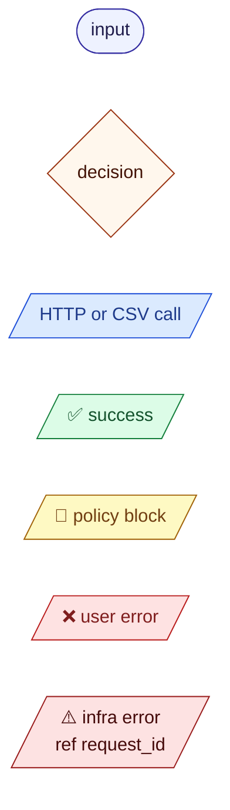
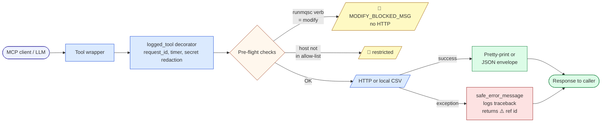
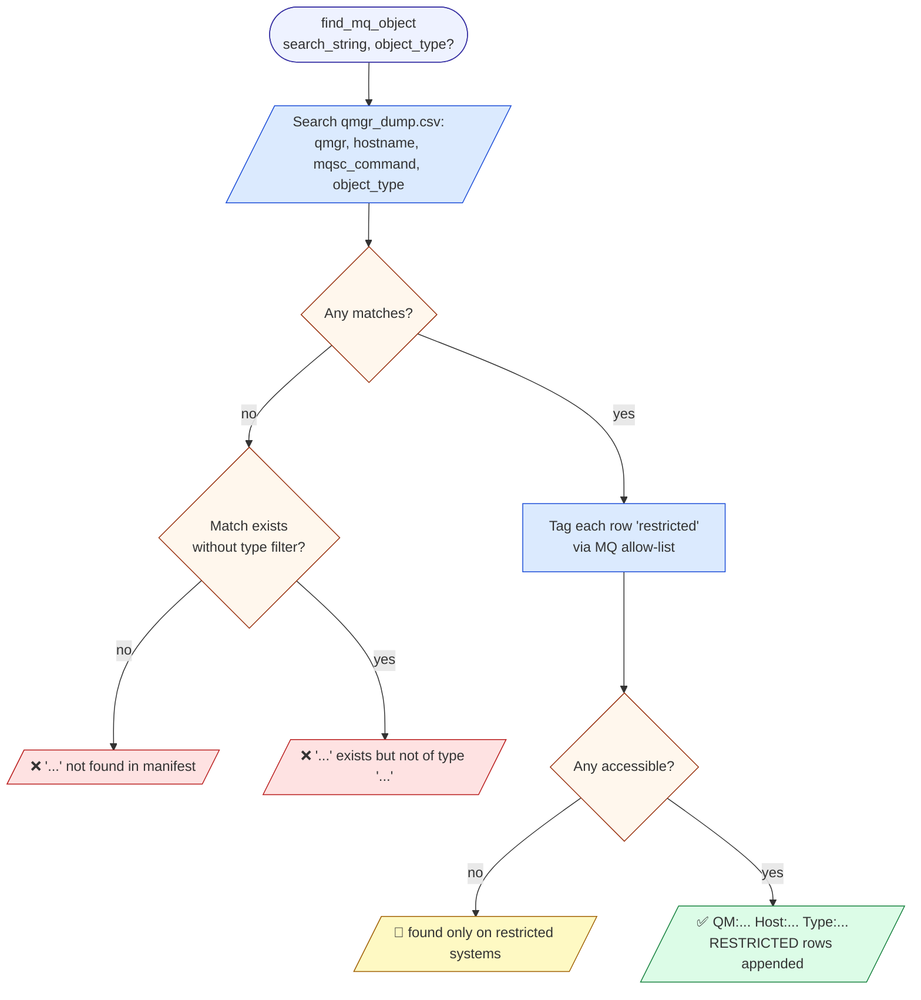
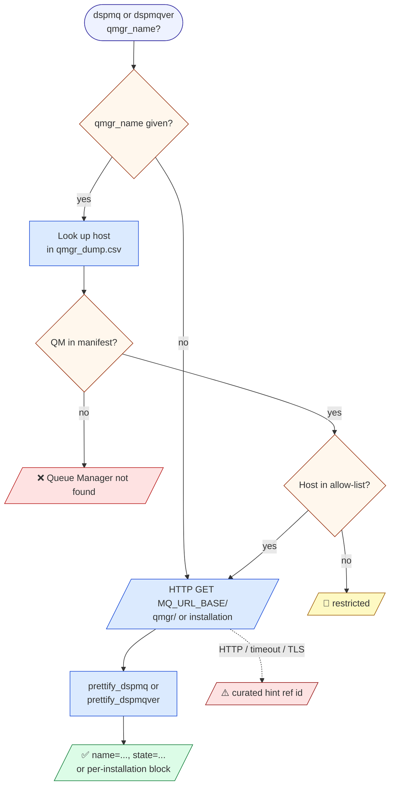
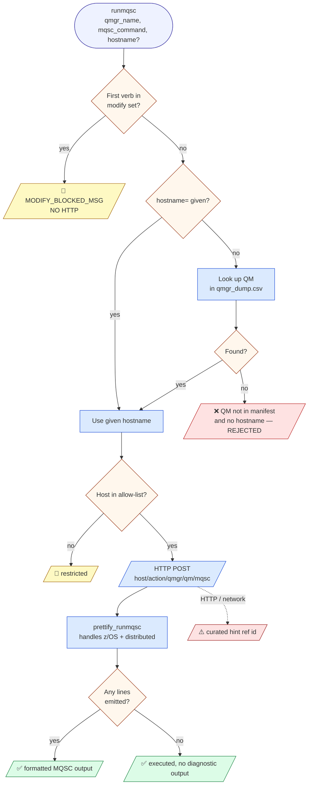
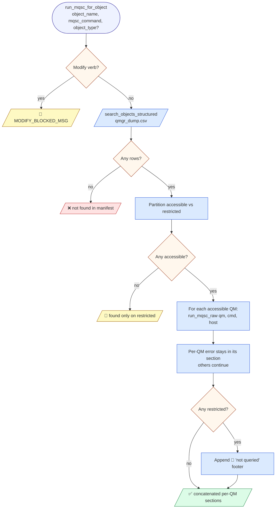
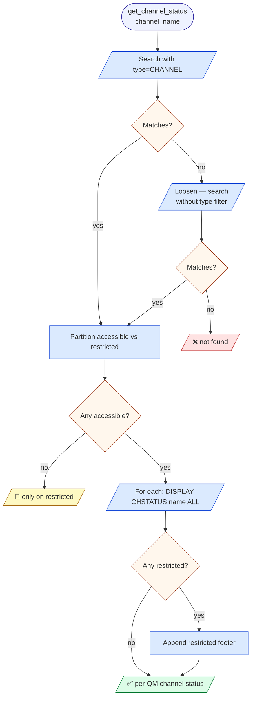
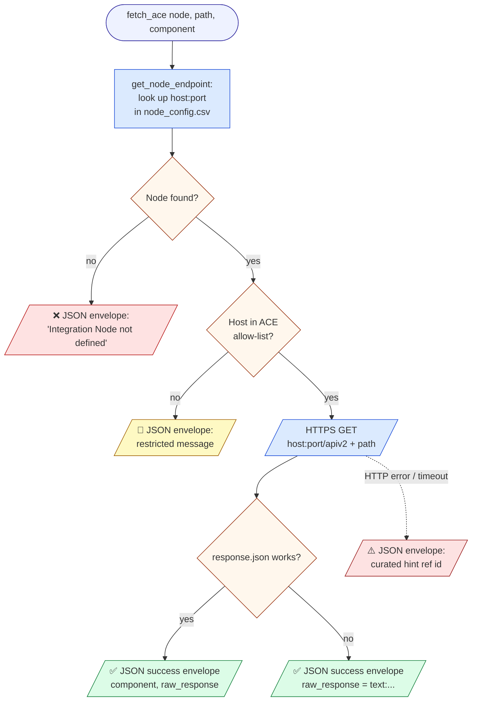
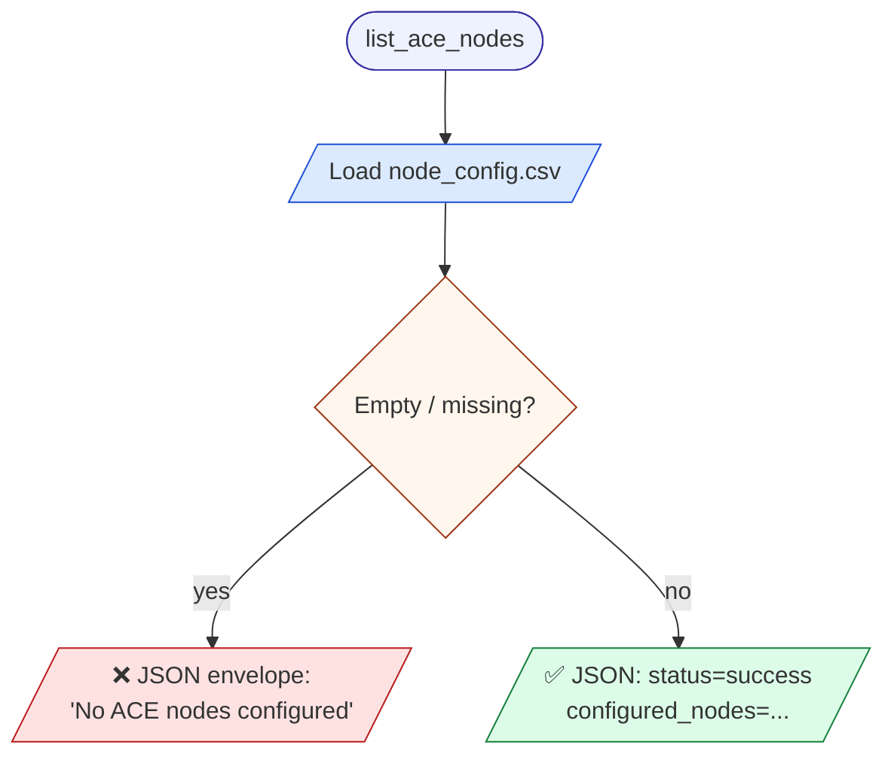
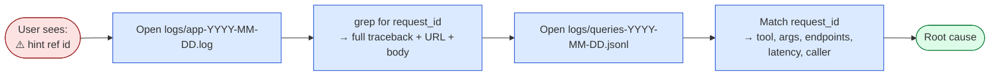

# Tool reference — how each MCP tool works (and what it falls back to)

Each tool below has one decision-flow diagram showing the resolution
chain end-to-end: inputs on the left, every branch labelled, and the
outcome at each leaf coloured by category.

> The diagrams use Mermaid — they render inline on GitHub and in any
> Markdown viewer with Mermaid support. The legend just below applies
> to every diagram in this doc.

## Legend



| Colour | Meaning |
|---|---|
| 🟦 blue | network or CSV call site |
| 🟩 green | successful response to caller |
| 🟨 yellow | policy block — caller's request was denied by design (allow-list, read-only guard) |
| 🟥 red | user/input error — bad name, missing manifest entry |
| 🟧 orange | decision point |
| 🟪 indigo | input to the tool |
| 🟥 dark red | sanitised infra error — full trace lives in `logs/app-*.log` under the same `request_id` |

---

## Architecture overview — every tool inherits this pipeline



**Five mechanisms wired in once, applied to every call:**

| # | Where | What it does |
|---|---|---|
| 1 | `server/safety.py:is_hostname_allowed` | Hostname prefix check against `MQ_/ACE_/SPLUNK_ALLOWED_HOSTNAME_PREFIXES`. |
| 2 | `server/safety.py:is_modification_command` / `is_unsafe_spl` | Blocks `ALTER/DEFINE/DELETE/CLEAR/MOVE/SET/RESET/START/STOP/PURGE/REFRESH/RESOLVE/ARCHIVE/BACKUP` in MQSC; blocks `delete/outputlookup/collect/sendemail/script/dump/…` in SPL (read-only Splunk). |
| 3 | `server/errors.py:safe_error_message` | Maps exceptions to curated hints, writes traceback to `logs/app-*.log`, returns `⚠️ … (ref <id>)`. |
| 4 | `server/query_log.py:record_endpoint` | Stamps each outbound URL onto the per-call JSONL record. |
| 5 | `mq_helpers._CSV_CACHE`, `ace_helpers._NODE_*_CACHE` | All three CSVs are loaded once, cached in-process; restart to refresh. |

---

# IBM MQ tools (7)

All MQ HTTP traffic goes through a shared `httpx.AsyncClient` with
`MQ_USER_NAME` / `MQ_PASSWORD` Basic Auth and `verify=False`.

## `find_mq_object` — OFFLINE manifest search



**Endpoints recorded:** none (CSV-only).

---

## `dspmq` / `dspmqver` — list QMs / installation info

Same flow for both; only the URL path and prettifier differ.



**Endpoints recorded:** the one URL actually hit.

---

## `runmqsc` — single read-only MQSC against a specific QM

Critical: there is **no silent fallback to using the QM name as a hostname**.



**Endpoints recorded:** the resolved `…/action/qmgr/<qm>/mqsc` URL.

---

## `run_mqsc_for_object` — discover, then fan out



**Endpoints recorded:** one `…/action/qmgr/<qm>/mqsc` URL per accessible QM, in order.

---

## `get_queue_depth` — depth across every host, alias-resolved

```mermaid
flowchart TD
  A([get_queue_depth<br/>queue_name]):::input
  A --> B[/search_objects_structured/]:::http
  B --> C{Any rows?}:::decision
  C -->|no| X1[/❌ not found/]:::user
  C -->|yes| D{Any accessible?}:::decision
  D -->|no| X2[/🚫 only on restricted/]:::policy
  D -->|yes| E{Name starts with QA.<br/>OR any row type = QALIAS?}:::decision
  E -->|yes — alias path| G[/DISPLAY QALIAS name/]:::http
  G --> H{TARGET(...) parsed<br/>from response?}:::decision
  H -->|no| Y1[/⚠️ couldn't resolve TARGET<br/>for this QM — continue/]:::err
  H -->|yes| I[/DISPLAY QLOCAL target CURDEPTH/]:::http
  E -->|no — direct path| J[/DISPLAY QLOCAL name CURDEPTH/]:::http
  I --> K[Per-QM output]:::http
  J --> K
  Y1 --> K
  K --> L{Any restricted?}:::decision
  L -->|yes| M[Append restricted footer]:::http
  L -->|no| OK[/✅ depth per accessible QM/]:::ok
  M --> OK

  classDef input fill:#eef2ff,stroke:#3730a3
  classDef decision fill:#fff7ed,stroke:#9a3412
  classDef http fill:#dbeafe,stroke:#1d4ed8
  classDef ok fill:#dcfce7,stroke:#15803d
  classDef policy fill:#fef9c3,stroke:#a16207
  classDef user fill:#fee2e2,stroke:#b91c1c
  classDef err fill:#fde2e2,stroke:#991b1b
```

**Endpoints recorded:** one or two `…/action/qmgr/<qm>/mqsc` URLs per accessible QM (two on the alias path).

---

## `get_channel_status` — status across every hosting QM



**Endpoints recorded:** one `…/action/qmgr/<qm>/mqsc` URL per accessible QM.

---

# IBM ACE tools (6)

Five of the six ACE tools route through a single helper, `fetch_ace`,
which encapsulates node resolution + allow-list + HTTP + envelope.

## The `fetch_ace` pipeline (shared by 4 tools)



`fetch_ace` **never raises** — every leaf above is a JSON envelope string.

### Which path each tool calls (and what it projects from the response)

| Tool | Path under `/apiv2` | Returned shape |
|---|---|---|
| `get_ace_node_status` | `<empty>` (i.e. `/apiv2`) | only `properties` + `descriptiveProperties` |
| `list_ace_servers` | `/servers?depth=2` | `servers: [{name, active, properties}, …]` |
| `list_ace_applications` | `/servers/<server>/applications?depth=2` | `raw_response.children: [{name, properties, descriptiveProperties, active}, …]` |
| `list_ace_message_flows` (no `app`) | `/servers/<server>/messageflows?depth=2` | raw envelope |
| `list_ace_message_flows` (`app` given) | `/servers/<server>/applications/<app>/messageflows?depth=2` | raw envelope |

> An unknown `server` or `app` is **not** validated locally — the upstream
> 404 surfaces as a sanitised `Endpoint not found (ref …)` envelope.

---

## `list_ace_nodes` — OFFLINE node config



**Endpoints recorded:** none (CSV-only).

---

## `search_ace_local_dump` — OFFLINE BIP-message search

```mermaid
flowchart TD
  A([search_ace_local_dump<br/>search_string]):::input
  A --> B[/Load node_dump.csv/]:::http
  B --> C[Substring match<br/>across all string columns]:::http
  C --> D{Any matches?}:::decision
  D -->|yes| OK[/✅ JSON: results=.../]:::ok
  D -->|no| E{node_dump.csv<br/>actually loaded?}:::decision
  E -->|no — missing/empty| X1[/❌ JSON: 'node_dump.csv empty or missing'/]:::user
  E -->|yes| X2[/✅ JSON: success, results=[]/]:::ok

  classDef input fill:#eef2ff,stroke:#3730a3
  classDef decision fill:#fff7ed,stroke:#9a3412
  classDef http fill:#dbeafe,stroke:#1d4ed8
  classDef ok fill:#dcfce7,stroke:#15803d
  classDef user fill:#fee2e2,stroke:#b91c1c
```

**Endpoints recorded:** none (CSV-only).

---

## `get_cert_details` — OFFLINE certificate-inventory search

```mermaid
flowchart TD
  A([get_cert_details<br/>search_string]):::input
  A --> B[/Load cert_dump.csv/]:::http
  B --> C[Substring match across all columns<br/>hostname, alias, cn_name,<br/>valid_from, valid_until, expirydays]:::http
  C --> D{Any matches?}:::decision
  D -->|yes| N[Per match: recompute expirydays live<br/>+ add ace_nodes from node_dump.csv]:::http
  N --> OK[/✅ JSON: results=[{...+ace_nodes}]/]:::ok
  D -->|no| E{cert_dump.csv<br/>actually loaded?}:::decision
  E -->|no — missing/empty| X1[/❌ JSON: 'cert_dump.csv empty or missing'/]:::user
  E -->|yes| X2[/✅ JSON: success, results=[]/]:::ok

  classDef input fill:#eef2ff,stroke:#3730a3
  classDef decision fill:#fff7ed,stroke:#9a3412
  classDef http fill:#dbeafe,stroke:#1d4ed8
  classDef ok fill:#dcfce7,stroke:#15803d
  classDef user fill:#fee2e2,stroke:#b91c1c
```

Returns one row per matching certificate with `hostname`, `alias`, `cn_name`
(the CN/subject), `valid_from`, `valid_until` (the expiry date), `expirydays`
(whole days until expiry — recomputed live against today's date, so it stays
accurate regardless of when the extract ran; negative means already expired),
and `ace_nodes` (the ACE integration node(s) running on that hostname, looked up
in `node_dump.csv` — empty for a pure-MQ host with no ACE node). The search
matches the string against ALL columns, so a user can look up by hostname,
alias, or CN. No live endpoint is inspected — cert/node freshness depends on the
extracts that produced `cert_dump.csv` / `node_dump.csv`.

**Endpoints recorded:** none (CSV-only).

---

# Splunk tools (3) — read-only log search for triage / root-cause

All Splunk traffic goes through a shared `httpx.AsyncClient` with
`SPLUNK_USER` / `SPLUNK_PASSWORD` Basic Auth and `verify=False`, posting to the
Splunk REST search-export endpoint. These answer the **historical "why did it
fail"** questions the live MQ/ACE tools cannot. Every SPL string is screened by
`is_unsafe_spl` (writes/exfil blocked) and the Splunk host passes the allow-list
**before** any call; failures are sanitised through `safe_error_message`.

> **Prerequisite:** the MQ error logs (`AMQERR0*.LOG`) and ACE syslog/event logs
> must already be forwarded into Splunk (index names set via `SPLUNK_MQ_INDEX` /
> `SPLUNK_ACE_INDEX`). The tools search what's indexed — they don't ingest.

```mermaid
flowchart TD
  A([splunk_search_logs / splunk_mq_errors / splunk_ace_errors]):::input
  A --> B{SPL contains a write/<br/>exfil command?}:::decision
  B -->|yes| X1[/🚫 SPL_BLOCKED_MSG<br/>NO HTTP/]:::policy
  B -->|no| C{Splunk host in<br/>allow-list?}:::decision
  C -->|no| X2[/🚫 restricted/]:::policy
  C -->|yes| D[/HTTPS POST<br/>services/search/jobs/export/]:::http
  D --> E[Parse ND-JSON result rows]:::http
  E --> OK[/✅ JSON envelope:<br/>status, count, events[]/]:::ok
  D -. HTTP / auth / timeout .-> Z[/⚠️ curated hint ref id/]:::err

  classDef input fill:#eef2ff,stroke:#3730a3
  classDef decision fill:#fff7ed,stroke:#9a3412
  classDef http fill:#dbeafe,stroke:#1d4ed8
  classDef ok fill:#dcfce7,stroke:#15803d
  classDef policy fill:#fef9c3,stroke:#a16207
  classDef err fill:#fde2e2,stroke:#991b1b
```

| Tool | What it searches | Key args |
|---|---|---|
| `splunk_search_logs` | Free-text terms across the MQ + ACE indexes over a time window. | `search_strings` (list), `source_type?` (omit unless the user names one), `earliest`/`latest` |
| `splunk_mq_errors` | AMQ error-log events scoped to one or more queue managers. | `qmgr_names` (list), `earliest` |
| `splunk_ace_errors` | BIP / error syslog scoped to one or more integration nodes. | `nodes` (list), `earliest` |

**Endpoints recorded:** the resolved `…/services/search/jobs/export` URL.

> **Triage / root-cause:** the chatbot's ReAct agent can pair a `splunk_*` search
> with a live `mq_*`/`ace_*` inspection — e.g. read MQRC 2016 from the logs, then
> confirm `GET(DISABLED)` on the live queue — and answer with the confirmed cause.
> See the TRIAGE PROTOCOL in the system prompts.

---

# Recovery — turning a `⚠️ … (ref <id>)` back into a root cause



For `🚫 …` messages the cause is policy, not a fault:

| Message | Policy | Fix |
|---|---|---|
| Hostname not in allowed list | `MQ_/ACE_ALLOWED_HOSTNAME_PREFIXES` | Add the prefix in `.env` and restart, or pick a host in the list. |
| Modification requests not permitted | `is_modification_command` block | Use a DISPLAY variant, or open a ServiceNow ticket per the message. |
| Found only on restricted systems | Object exists but every hosting host is outside the allow-list | Same as above — adjust the allow-list deliberately. |

The server never auto-retries — recovery is at the orchestrator or
operator level. Backoff / circuit-breaker are intentionally out of
scope (see CLAUDE.md → "Things that are deliberately NOT done").
